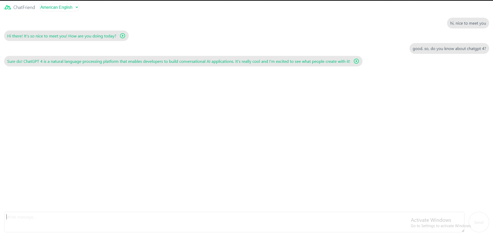

# openai-chatfriend

This project is a chatbox application built using [Nuxt 3](https://nuxt.com/v3) powered by [OpenAI Text completion endpoint](https://beta.openai.com/docs/guides/completion).

You can select different personality of your AI friend that you want to chat. It will then emulate normal conversation between friends. The default AI friend will respond in Japanese. You can use this app to practice chatting with a Japanese person!


# The App

## American English



## Filipino

> There are no Filipino voice available from `Speech Synthesis` api so the play button is removed.

By writing a descriptive introduction in your prompt, it is possible to create different personality of your AI chat friend. Depending on the availability, the reply will be spoken using [Web Speech API](https://developer.mozilla.org/en-US/docs/Web/API/Web_Speech_API).

# Development

Using the latest version of `Nuxt`

```sh
$ npx nuxi init <project-name>
```


# OpenAI

To install `OpenAI` node module

```sh
$ npm install openai
```

For `API Key` register for an account at [OpenAI](https://openai.com/api/).

Create `.env` file

```javascript
NUXT_API_KEY = my - openai - api - key - sample;
```

Then we will only be calling the openai's `completion endpoint` from our own server api endpoint.

`/server/api/chat.js` file

```javascript
import { Configuration, OpenAIApi } from "openai";

const config = useRuntimeConfig();

const configuration = new Configuration({
    apiKey: config.apiKey,
});

const openai = new OpenAIApi(configuration);

export default defineEventHandler(async (event) => {

    const completion = await openai.createCompletion({
        model: "text-davinci-003",
        prompt: "You: Hello!\nFriend: How are you?\nYou: Good morning!\nFriend:",
        temperature: 0.5,
        max_tokens: 60,
        top_p: 1,
        frequency_penalty: 0.5,
        presence_penalty: 0,
        stop=["You:"]
    });

    return {
        text: completion.data.choices[0].text,
    }

})
```

## max_tokens

The `max_tokens` value plus the token count of the prompt should not exceed 2048 (or 4096 for newest models).
If exceeded then previous conversation get deleted.

# Setup

Clone the repository and install the dependencies

```sh
$ git clone https://github.com/supershaneski/openai-chatfriend.git myproject

$ cd myproject

$ npm install
```

Create `.env` file in the root directory and supply your own `OpenAI API Key`

`.env` file

```javascript
NUXT_API_KEY = my - openai - api - key - sample;
```

Then run the app

```sh
$ npm run dev
```

Open your browser to `http://localhost:5000/` to load the application page.


## Production

Build the application for production:

```bash
npm run build
```

Locally preview production build:

```bash
npm run preview
```

## Author
- Nibhrant Vaishnav
- Riyanshi
- Sumukh Bendre
- Sheetal Kaushik

